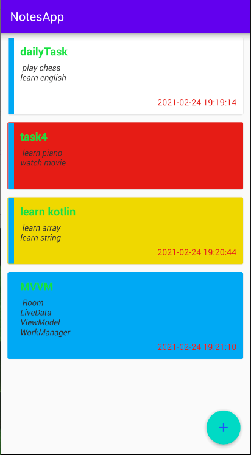

# NoteApp
learn Retrofit2 and webservice with phpserver

# Usage

# Built With
 - MVP 
 - Retrofit - A type-safe HTTP client for Android and Java
 - PHP/mysql server simple
 - Gson - A Java serialization/deserialization library to convert Java Objects into JSON and back

 
# Acknowledgments
  - Inspiration Simple NoteApp
  - MaterialDesignDemo by devhue97

